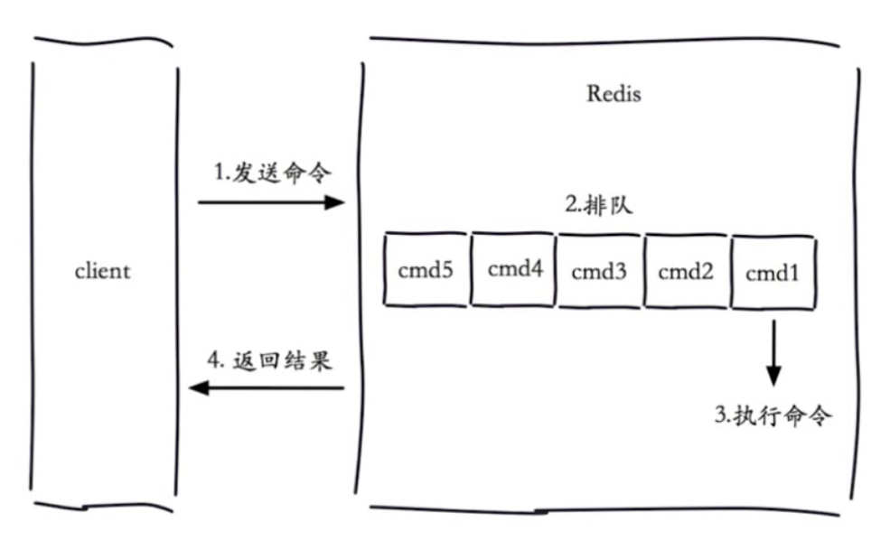
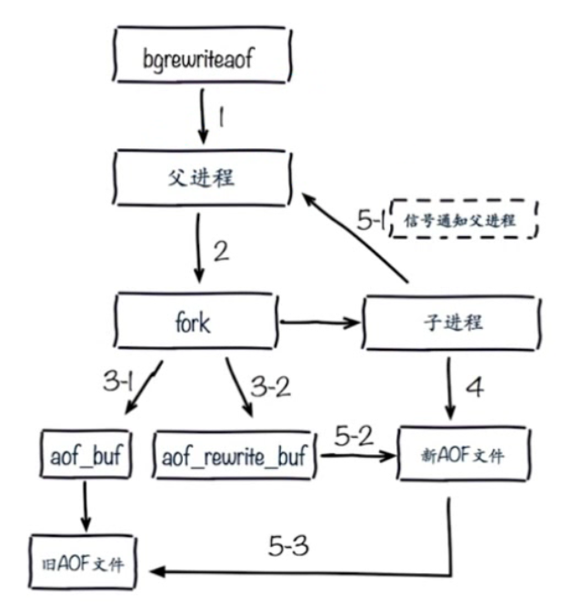
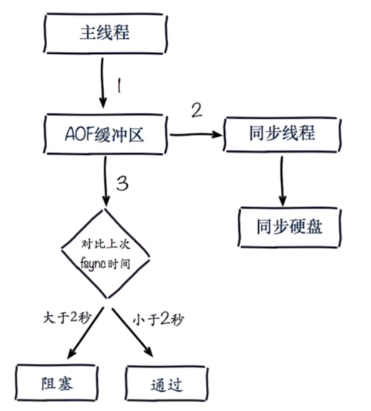
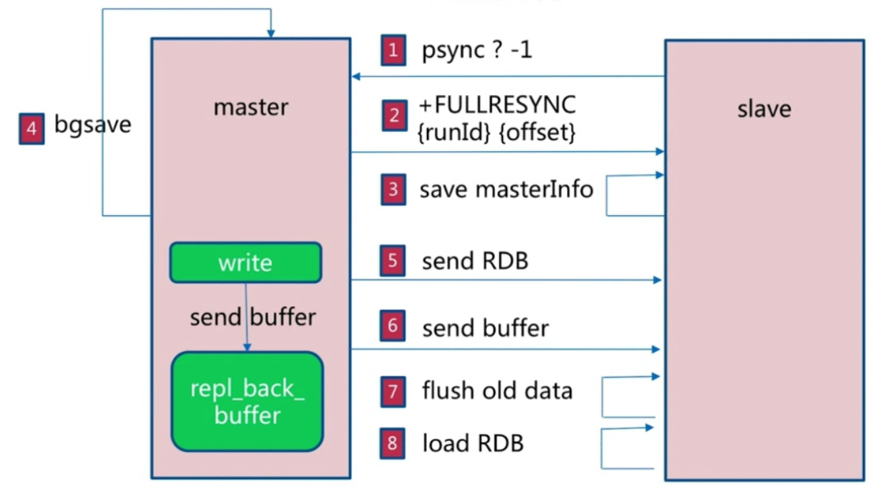
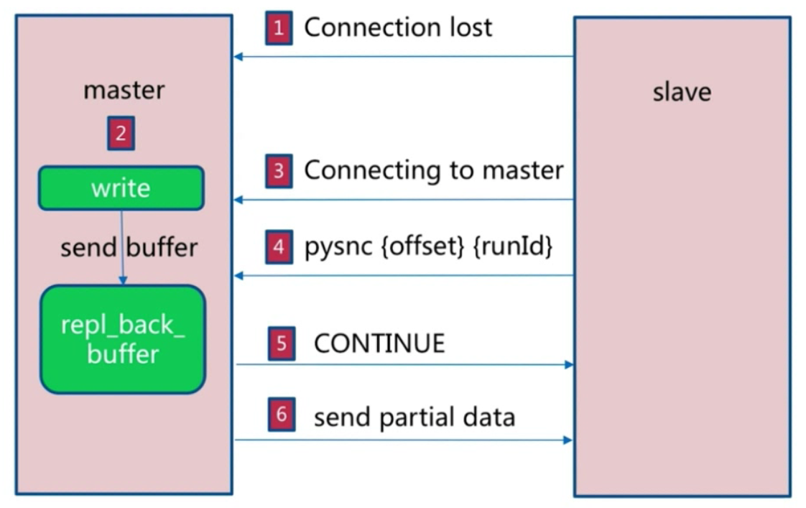

# 慢查询查询
慢查询相关配置默认值
```shell
# 记录慢查询的总条数
config get slowlog-max-len = 128
# 超过多长时间被记录为慢查询，单位微秒
config get slowlog-log-slower-than = 10000
```

慢查询相关的命令
```shell
# 获取慢查询队列
slowlog get [n]
# 获取慢查询队列长度
slowlog len
# 清空慢查询队列
slowlog reset
```

1、slowlog-max-len不要设置的过大，默认是10ms，通常可以设置成1ms
2、slowlog-log-slower-than不要设置的过小，通常设置成1000左右大小
3、理解命令的生命周期

4、定期持久化慢查询


# Bitmap的使用!!!!!!!!

# HypeLogLog的使用，以及实际使用场景？

# Geo，经纬度计算
@since 3.2+
type geoKey = zSet

# Redis持久化之RDB
save:   同步 阻塞             复杂度： O(N)
    缺点：阻塞客户端命令
    优点：不会消耗额外内存
bgsave: 异步 Fork子进程时阻塞  复杂度： O(N)
    缺点：需要Fork子进程，消耗内存
    优点：不阻塞客户端命令

RDB相关的配置
```shell
save 900 1
save 300 10
save 60 10000
dbfilename dump.rdb
dir ./
stop-writes-on-bgsave-error yes
rdbcompression yes
rdbchecksun yes
```

相对最佳配置
```shell
# save 900 1
# save 300 10
# save 60 10000
dbfilename dump-${port}.rdb
dir /big_disk_path
stop-writes-on-bgsave-error yes
rdbcompression yes
rdbchecksun yes
```

> 总结：
1、RDB时Redis内存到硬盘的快照，用于持久化
2、save会阻塞Redis的指令执行
3、bgsave不会阻塞Redis，但是会fork新进程
4、save自动配置满足任一就会被执行
5、有些触发机制也会触发RDB，比如：debug reload   shutdown都会触发RDB
  因为shutdown会触发RDB，在关闭Redis时防止数据丢失，使用shutdown命令正常关闭redis后重启

# Redis持久化之AOF
AOF为追加操作日志的方式进行持久化，AOF策略会先将操作写到缓冲区，然后根据指定的刷盘策略将日志刷到硬盘中。
AOF将数据从缓冲区刷到磁盘的策略：
- always   优点：不丢失数据                       缺点：IO开销交到，一般的sata盘只有几百TPS
- everysec 优点：每秒一次fsync，丢1秒数据          缺点：丢一秒数据
- no       优点：不用管，操作系统控制              缺点：不可控

#### AOF重写
AOF重写的作用：
减少硬盘占用量
加快重启恢复速度

```shell
bgrewriteaof
```

client -> 发出bgrewriteaof指令 -> redis server(Master进程) -> fork -> redis 子进程 -> 从内存重写AOF文件 

AOF重写配置
```shell
# 开启AOF
appendonly yes
appendfilename "appendonly-${port}.aof"
# 设置AOF刷盘策略
appendfsync everysec
dir /big_disk_path
# 在进行AOF重写的时候，不再进行AOF的追加操作
no-appendfsync-on-rewrite yes
# AOF文件重写需要的尺寸
auto-aof-rewrite-min-size 64m
# AOF重写的增长率
auto-aof-rewrite-percentage 100
```

AOF相关的统计数值
```shell
aof_current_size AOF当前的尺寸（单位：字节）
aof_base_size AOF上次启动和重写的尺寸（单位：字节）
```


关键点：在AOF重写期间会存在一个双写的过程。

# Redis持久化RDB与AOF比较
| 命令      | RDB   | AOF |
| ----      | ----  | ---- |
| 启动优先级 | 低    | 高 |
| 体积      | 小     | 大 |
| 恢复速度   | 快    | 慢 |
| 数据安全性 | 丢数据 | 根据策略决定 |
| 轻重       | 重    | 轻 |

> 总结：
小分片

# Redis持久化运维问题
fork->内存页拷贝，并不是内存拷贝？
> 需要注意的问题：
1、fork操作是同步操作
2、与内存量息息相关：内存越大，耗时越长（与机器类型有关）
3、info: latest_fork_usec，该属性信息记录来上一次fork耗时，通过这个info信息可以判断持久化对业务的影响程度。

>改善fork
1、优先使用物理机或者高效支持fork操作的虚拟化技术
2、控制Redis实例最大可用内存： maxmemory
3、合理配置LInux内存分配策略： vm.overcommit_memory=1 ，默认值为0，则表没有足够内存分配时，不进行内存分配，导致fork时无法分配到内存，当然最直接的问题还是redis内存使用过多导致。
4、降低fork的频率：例如放宽AOF重写的自动触发时机，避免不必要的全量复制。即：调整AOF的重写增长率

>fork子进程的开销和优化
1、CPU：
  开销：RDB和AOF文件生成，属于CPU密集型
  优化：不做CPU的绑定，不和CPU密集型的应用部署在一起
2、内存：
  开销：fork内存开销，copy-on-write
  优化：echo never > /sys/kernel/mm/transparent_hugepage/enabled
3、硬盘：
  开销：AOF和RDB文件写入，可以结合iostat,iotop分析
  优化：
  不要和高硬盘负载服务部署一起，比如：存储服务、消息队列等
  no-appendfsync-on-rewrite = yes
  根据写入量决定硬盘类型：例如：ssd
  单击多实例持久化文件目录挂载到不同的硬盘上，或者数据卷上

>AOF追加阻塞

步骤一：主线程写入AOF缓冲区会存在一个同步操作
步骤二：当触发一定的AOF缓存刷盘规则时fork子进程刷盘
步骤三：主进程在刷了缓冲区后，会对比上次fsync时间，如果上次开始刷盘时间已经过去2秒，则会进行阻塞，如果小于2秒则会继续下一个指令操作。
如果AOF刷盘操作太慢，AOF的追加可能会造成主进程的阻塞。

>是否存在AOF阻塞问题定位
Redis日志存在该日志： 
```
Asynchronous AOF fsync is taking too long (dis is busy?).
Writing the AOF buffer without waiting for fsync to complete, this may slow down Redis.
```
info persistence
```shell
>info persistence
...
...
aof_delayed_fsync: 100
...
...
```
根据aof_delayed_fsync判断存在多少次AOF阻塞的问题。


# Redis的主从复制
主从复制的作用：
1、数据副本
2、扩展读能力
>一个master可以有多个slave
一个slave只能有一个master
数据是单向的，只能master到slave

怎么讲节点做成slave
```shell
slaveof ip port
slave-read-only yes
```
这样就可以将节点制定为slave，并且指定那台机器为master
```shell
> info replication
role:master
connected_slaves:0
master_repl_offset:0
```
通过如上命令可以查看副本状态

```shell
>info server | grep run
run_id:ssss
```
通过该命令可以查询到run_id，每次重启run_id将改变，如果主节点重启，slave发现主节点run_id变化，将会进行全量同步。

>如何检查主从节点的同步存在异常？
可以使用 info replication 查看副本状态，查看主从节点的slave_repl_offset偏移量差别。

>全量复制流程


>全量复制开销
1、bgsave时间
2、RDB文件网络传输时间
3、从节点清空数据时间
4、从节点加载RDB的时间
5、可能的AOF重写时间

>部分复制流程

关键点： 是从节点与主节点之间的网络发生抖动，连接断开后重连，并且偏移数据没有超过主节点的缓冲区repl_back_buffer

# 主从复制常见的运维开发问题
>读写分离
1、读写分离：读流量分摊到从节点
2、可能遇到问题：
- 复制数据延迟
- 读到过期数据
- 从节点故障

>配置不一致，导致从节点启用数据淘汰机制

>规避全量复制
1、第一次全量复制
- 第一次不可避免
- 解决：小主节点、低峰
2、节点运行ID不匹配
- 主节点重启，运行ID变化
- 解决：故障转移，例如哨兵或集群
3、复制积压缓冲区不足
- 网络中断，部分复制无法满足，会进行全量复制
- 解决：增大复制缓冲区配置rel_backlog_size，网络“增强”

# 规避复制风暴
1、单主节点复制风暴：
- 问题：主节点重启，多从节点复制
- 解决：更换复制拓扑，避免多个slave同时从主节点拉取数据

2、单机器复制风暴
- 如果一个机器上多个主节点，大量全量复制
- 主节点分散多机器

