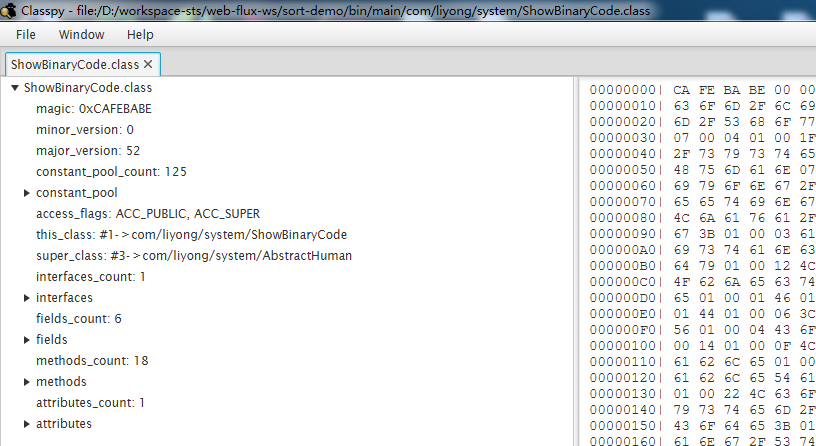
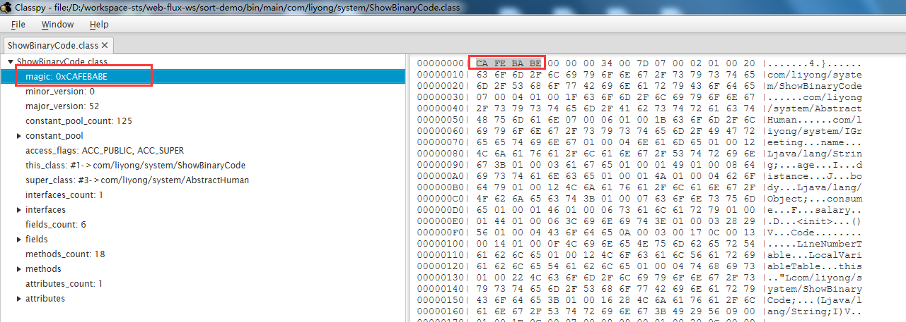
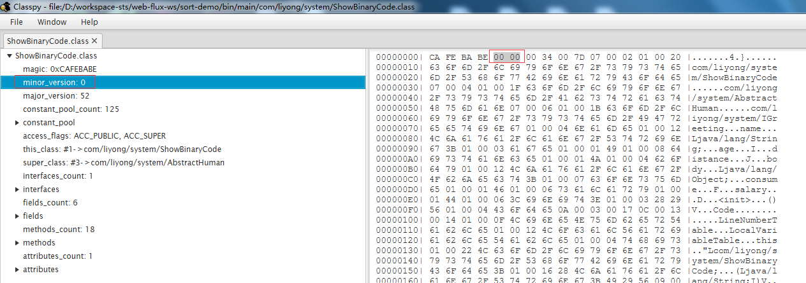
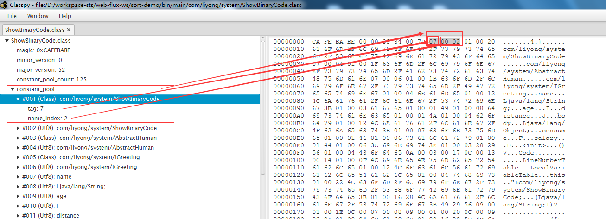

### Class类文件结构
- Java跨平台的基础
- Class的本质
> - Class文件是一组以8字节为基础单位的二进制流
> - 类似于结构体的伪结构来存储数据
> - 无符号数属于基本的数据类型，以 u1 u2 u4 u8
> - 表是由多个无符号数或者其他表作为数据项构成的复合数据类型

> 参考文档： https://juejin.im/post/5d884c766fb9a06ae76444dc  这个地址对class中的各个组成部分有详细讲解。  
> 
> class字节码可视化解析工具`Classpy`： https://github.com/zxh0/classpy

--- 


Class文件格式：
```shell script
ClassFile {
  u4              magic; # 魔数：占用4个字节的无符号数，固定为0xCA_FE_BA_BE，用来标识该文件是class文件
  u2              minor_version;
  u2              major_version;
  u2              constant_pool_count;
  cp_info         constant_pool[constant_pool_count-1];
  u2              access_flags;
  u2              this_class;
  u2              super_class;
  u2              interface_count;
  u2              interface[interface_count];
  u2              fields_count;
  field_info      fields[fields_count];
  u2              methods_count;
  method_info     methods[methods_count];
  u2              attributes_count;
  attribute_info  attributes[attributes_count];
}
```
如上面的代码，class文件主要包括：magic、minor version、major version、constant pool、access flags、
this class、super class、interface class、fields、methods、attribute 11个部分组成。

通过源码来对class进行分析：
定义一个接口：
```java
package com.liyong.system;

public interface Human {
	void walk();
}
```

定义一个抽象类：
```java
package com.liyong.system;

public abstract class AbstractHuman implements Human {

	@Override
	public void walk() {
		System.out.println("walking....");
	}
	
	protected abstract void doSomething();

}
```

再定义一个接口：
```java
package com.liyong.system;

public interface IGreeting {
	void sayHello(String msg);
	void work(String task1, String task2);
}
```

写一个实现类：
```java
package com.liyong.system;

public class ShowBinaryCode extends AbstractHuman implements IGreeting {
	private String name;
	private int age;

	public ShowBinaryCode() {
	}

	public ShowBinaryCode(String name, int age) {
		super();
		this.name = name;
		this.age = age;
	}

	public static void main(String[] args) {
		ShowBinaryCode code = new ShowBinaryCode();
		code.setName("Li");
		code.setAge(100);
		System.out.println("code: " + code);
	}

	public String getName() {
		return name;
	}

	public void setName(String name) {
		this.name = name;
	}

	public int getAge() {
		return age;
	}

	public void setAge(int age) {
		this.age = age;
	}

	private long distance;
	private Object body;
	private float consume;
	private double salary;

	public long getDistance() {
		return distance;
	}

	public void setDistance(long distance) {
		this.distance = distance;
	}

	public Object getBody() {
		return body;
	}

	public void setBody(Object body) {
		this.body = body;
	}

	public float getConsume() {
		return consume;
	}

	public void setConsume(float consume) {
		this.consume = consume;
	}

	public double getSalary() {
		return salary;
	}

	public void setSalary(double salary) {
		this.salary = salary;
	}

	@Override
	public void sayHello(String msg) {
		System.out.println("msg: " + msg);
	}

	@Override
	public void work(String task1, String task2) {
		System.out.println(task1 + " -->  " + task2);
	}

	@Override
	protected void doSomething() {
		System.out.println("do something");
	}
}
```

> 这里设计`Human`接口，再设计一个抽象类`AbstractHuman`并实现`Human`。
> 在设计一个接口`IGreeting`。
> 编写一个实现类`ShowBinaryCode`继承`AbstractHuman`，实现`IGreeting`。

直接通过反编译工具，反编译`ShowBinaryCode`类  
工具：IntelliJ IDEA 2020.1 x64，直接打开class进行反编译  
```java
//
// Source code recreated from a .class file by IntelliJ IDEA
// (powered by Fernflower decompiler)
//

package com.liyong.system;

public class ShowBinaryCode extends AbstractHuman implements IGreeting {
    private String name;
    private int age;
    private long distance;
    private Object body;
    private float consume;
    private double salary;

    public ShowBinaryCode() {
    }

    public ShowBinaryCode(String name, int age) {
        this.name = name;
        this.age = age;
    }

    public static void main(String[] args) {
        ShowBinaryCode code = new ShowBinaryCode();
        code.setName("Li");
        code.setAge(100);
        System.out.println("code: " + code);
    }

    public String getName() {
        return this.name;
    }

    public void setName(String name) {
        this.name = name;
    }

    public int getAge() {
        return this.age;
    }

    public void setAge(int age) {
        this.age = age;
    }

    public long getDistance() {
        return this.distance;
    }

    public void setDistance(long distance) {
        this.distance = distance;
    }

    public Object getBody() {
        return this.body;
    }

    public void setBody(Object body) {
        this.body = body;
    }

    public float getConsume() {
        return this.consume;
    }

    public void setConsume(float consume) {
        this.consume = consume;
    }

    public double getSalary() {
        return this.salary;
    }

    public void setSalary(double salary) {
        this.salary = salary;
    }

    public void sayHello(String msg) {
        System.out.println("msg: " + msg);
    }

    public void work(String task1, String task2) {
        System.out.println(task1 + " -->  " + task2);
    }

    protected void doSomething() {
        System.out.println("do something");
    }
}
```


通过工具`Classpy`对class文件解析如下图：


通过`Classpy`可以清楚地看到一个class组成部分是固定的，就是11个部分。

1. magic  

魔数：占用4个字节的无符号数，固定为0xCA_FE_BA_BE，用来标识该文件是class文件

2. minor version

次版本号：占两个字节的无符号数，范围0～65535，与major version一起表示当前class文件的版本.。
jvm可以向前兼容之前的版本，但不能向后兼容，即jdk7的虚拟机不能运行jdk8编译的class

3. major version  

主版本号： 占两个字节的无符号数，jdk1.1使用的主版本号是45，以后每个大版本加1，如jdk1.8为52

4. constant pool  

通过`constants_pool_count`确认了常量池中常量的数量。
  
常量池： 常量池是class中十分重要的一部分，它可不是只保存着类中定义的常量而已，还保存着class文件中的各种元数据，
包括一些字符串，类名，接口名，字段名，方法名等等……，
它的作用就是被引用，常量池部分首先2个字节u2记录它包含的常量个数。

> 常量池就是一系列的数组，它的下标是从1开始的，即有效大小是constants_pool_count-1，
> 第0项是无效的，有些结构可以用索引0来标识没哟对应常量的引用。

> 常量池的设计有效的减小了class文件的大小，所有需要使用比如类名、方法名等的地方都只需要u2来标识其名称所在的索引即可。


constant分类：  
对于不同的constant,在class中使用tag来表示不同类型的constant。    
---
tag = 1  
```shell script
CONSTANT_Utf8_info {
    u1 tag;
    u2 length;
    u1 bytes[length];
}
```
  
```shell script
CONSTANT_Utf8 {
    tag: 1;
    length: 32;
    bytes: com/liyong/system/ShowBinaryCode;
}
```

---
tag=3  
```shell script
CONSTANT_Integer {
    u1 tag;
    u4 bytes;
}
```
  
```shell script
CONSTANT_Integer {
    tag: 3;
    bytes: 18;
}
```
> - int，tag=3，接下来4个字节表示该int的值。  
> - java中short, char, byte, boolean使用int来表示，boolean数组则用byte数组来表示（1个byte表示1个boolean元素）

---


5. access flags  
access flags表示类，接口，字段，方法的访问控制和修饰信息。

6. this class
当前类或接口，指向一个CONSTANT_Class_info常量，可以从中解析当前类的全限定名称。
包名层次用/分割，而不是.，如java/lang/Object。

